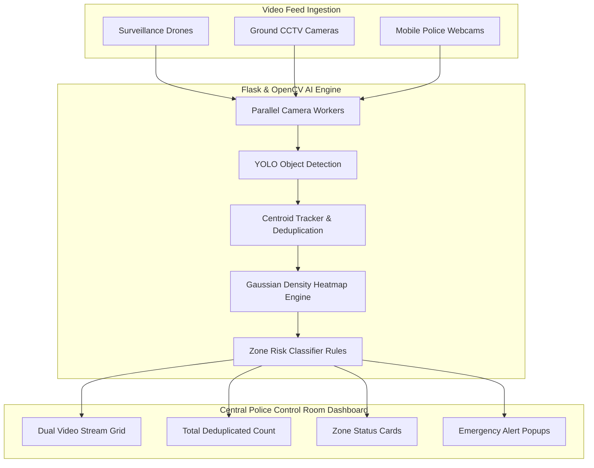
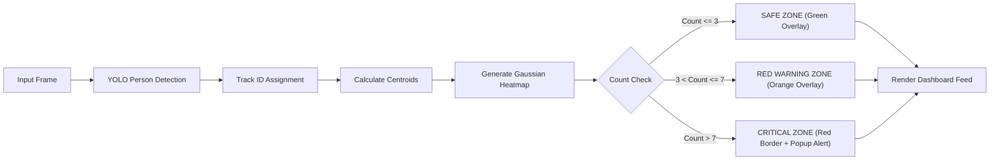

# 🛡️ AI Crowd Safety & Intelligence Monitoring System

> **Real-Time Mass Gathering Crowd Management & Emergency Response Platform for Law Enforcement & Event Security**

[](https://python.org)
[](https://flask.palletsprojects.com/)
[](https://ultralytics.com)
[](https://opencv.org/)
[](LICENSE)

---

## 📌 Executive Summary

The **AI Crowd Safety & Intelligence Monitoring System** is an advanced, real-time computer vision and crowd analytics platform engineered specifically for law enforcement agencies, police control rooms, and disaster management authorities.

Designed for high-density public mass gatherings such as **Kumbh Mela, political rallies, religious pilgrimages, sports stadiums, and mega-cultural events**, the platform ingests live feeds from **aerial surveillance drones, ground-level CCTV cameras, and mobile police units**. Using deep learning object detection (YOLOv11), object tracking, and Gaussian spatial heatmaps, the system automatically quantifies crowd density, detects abnormal crowd surges/stampede risks, monitors restricted perimeter breaches, and triggers real-time visual alert popups in central control rooms.

---

## 🌟 Key Capabilities & Features

### 📡 Multi-Source Stream Ingestion
- **Aerial & Ground Integration**: Ingests MJPEG/RTSP feeds from surveillance drones, CCTV networks, and portable mobile cameras simultaneously.
- **Auto-Reconnection Loop**: Resilient background threading automatically reconnects dropped camera feeds without interrupting central dashboard monitoring.

### 🧠 Deep Learning AI Engine
- **Real-Time YOLO Person Detection**: Tracks individuals with high confidence ($\ge 0.40$) at real-time frame rates.
- **Object Deduplication**: Persistent tracking IDs (`track_id`) prevent duplicate counts from stationary individuals or camera jitter.
- **Gaussian Density Heatmaps**: Renders smooth 2D Gaussian density heatmaps (`COLORMAP_JET`) transparently overlaid on live feeds.

### 🚦 Zone Risk Classification & Threshold Rules
- 🟢 **SAFE ZONE ($\le 3$ People / Frame)**: Normal density, safe pedestrian flow.
- 🟠 **RED WARNING ZONE ($> 3$ People / Frame)**: Elevated density; triggers early warnings for crowd control officers.
- 🔴 **CRITICAL HIGH-RISK ZONE ($> 7$ People / Frame)**: High stampede/surge risk; triggers visual dashboard alert banners, perimeter warnings, and audit logging.

### 🚨 Real-Time Emergency Popups & Restricted Area Surveillance
- **Instant Pop-Up Alerts**: Flashing visual warning banners alert operators to critical congestion or unauthorized perimeter entry.
- **Deduplicated Analytics**: Real-time breakdown of total crowd count, per-camera metrics, and zone threat levels.

---

## 🏗️ System Architecture & Workflow

### 1. High-Level System Architecture



---

### 2. Live Frame Processing & Risk Decision Pipeline



---

## 📂 Repository Directory Structure

```text
Crowd_Monitoring_System/
│
├── app.py                 # Primary Flask backend server, AI threads, and API routes
├── index.html             # Police Control Room dashboard interface
├── style.css              # Dark-mode responsive styling & emergency alert banners
├── script.js              # Real-time API polling, event logs & UI updates
├── yolo11n.pt             # Ultralytics YOLOv11 deep learning model weights
├── .gitignore             # Excluded virtual environments and cache
└── README.md              # Project documentation
```

---

## ⚡ Quick Start Guide

### Prerequisites
- **Python**: 3.10 or higher
- **Pip**: Latest version
- **Hardware**: CPU (GPU supported with CUDA PyTorch)

### 1. Clone Repository
```bash
git clone https://github.com/Chaitu1710/Crowd_Monitoring_System.git
cd Crowd_Monitoring_System
```

### 2. Create & Activate Virtual Environment
```powershell
# Windows PowerShell
python -m venv venv
.\venv\Scripts\activate
```

### 3. Install Dependencies
```bash
pip install flask ultralytics opencv-python numpy
```

### 4. Configure Mobile/CCTV Camera IPs
Open `app.py` and set your live camera URLs in `CAMERAS`:
```python
CAMERAS = {
    "cam1": {
        "id": "cam1",
        "name": "Camera 1 (Entrance Zone)",
        "url": "http://192.168.137.125:8080/video",
        "ip": "192.168.137.125:8080"
    },
    "cam2": {
        "id": "cam2",
        "name": "Camera 2 (Main Hall)",
        "url": "http://192.168.137.60:8080/video",
        "ip": "192.168.137.60:8080"
    }
}
```

### 5. Launch the Server
```bash
python app.py
```

### 6. Open Control Dashboard
Navigate to `http://localhost:5000` in your web browser.

---

## 📡 REST API Documentation

| Endpoint | Method | Description |
| :--- | :--- | :--- |
| `/` | `GET` | Serves the central police dashboard UI. |
| `/video_feed/<cam_id>` | `GET` | Live MJPEG stream with AI bounding boxes, track IDs, and density heatmap. |
| `/people` | `GET` | Returns JSON payload with total deduplicated counts, per-camera counts, and zone risks. |
| `/health` | `GET` | System health status and active camera count. |

### Sample `/people` JSON Output:
```json
{
  "total_count": 12,
  "status": "CRITICAL",
  "critical_zone_active": true,
  "warning_zone_active": true,
  "cameras": {
    "cam1": {
      "name": "Camera 1",
      "ip": "192.168.137.125:8080",
      "count": 4,
      "zone_risk": "RED ZONE (>3)",
      "risk_level": "WARNING",
      "connected": true
    },
    "cam2": {
      "name": "Camera 2",
      "ip": "192.168.137.60:8080",
      "count": 8,
      "zone_risk": "CRITICAL ZONE (>7)",
      "risk_level": "CRITICAL",
      "connected": true
    }
  },
  "timestamp": 1789177500.12
}
```

---

## 🛡️ Real-World Deployment Scenarios

* **Kumbh Mela & Pilgrimages**: Monitoring riverbank ghats, narrow pathways, and temple entrances to prevent overcrowding.
* **Political Rallies & Stadiums**: Monitoring entry gates, seating enclosures, and VIP restricted zones.
* **Disaster Response & Surge Management**: Real-time situational awareness for field police commanders to dispatch crowd control squads proactively.

---

## 📜 License

Distributed under the **MIT License**. See `LICENSE` for details.
